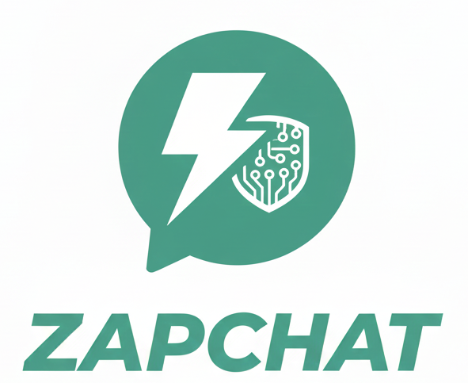

# ZapChat - AI-Powered Chat Application

<div align="center">
  
  
  **Experience seamless conversations with advanced AI technology**
  
  [](https://flutter.dev)
  [](https://dart.dev)
  [](LICENSE)
  [](https://flutter.dev)
</div>

## 📱 About ZapChat

ZapChat is a modern, feature-rich AI chat application built with Flutter that provides an intuitive and engaging conversational experience. Inspired by ChatGPT's design principles, ZapChat offers a clean, responsive interface with powerful AI integration and comprehensive chat management features.

## ✨ Key Features

### 🤖 **AI Integration**
- **Real-time AI Conversations** - Powered by HuggingFace AI models
- **Streaming Responses** - Live word-by-word response generation
- **Context Awareness** - Maintains conversation history for coherent dialogues
- **Markdown Support** - Rich text formatting in AI responses (bold, italic, code blocks, lists)
- **Customizable System Prompts** - Personalize AI behavior and responses

### 💬 **Chat Management**
- **Multiple Chat Sessions** - Create and manage unlimited conversations
- **ChatGPT-Style Sidebar** - Easy navigation between chat histories
- **Persistent Storage** - All conversations saved locally with Hive database
- **Session Titles** - Auto-generated titles from first user message
- **Message Limits** - Smart handling with 50-message conversation limits
- **Clear All Chats** - Complete data reset functionality

### 🎨 **User Interface**
- **Responsive Design** - Adapts seamlessly to phones, tablets, and different screen sizes
- **Material Design 3** - Modern, clean interface following Google's design guidelines
- **Dark/Light Themes** - System-aware theme switching with custom color schemes
- **Smooth Animations** - Polished transitions and micro-interactions
- **Splash Screen** - Branded startup experience with animated logo
- **Custom Branding** - Logo integration throughout the application

### 📱 **Mobile Experience**
- **Overlay Sidebar** - Slide-in navigation for mobile devices
- **Touch-Optimized** - Finger-friendly interface elements
- **Keyboard Handling** - Smart input management and auto-scroll
- **Gesture Support** - Tap-to-dismiss overlays and intuitive navigation
- **Responsive Typography** - Text scaling based on screen dimensions

### ⚙️ **Settings & Customization**
- **Theme Management** - System, Light, and Dark mode options
- **AI Configuration** - Editable system prompts and behavior settings
- **Data Management** - Clear chat history and reset functionality
- **About Information** - App version and developer details

## 🛠️ Technical Specifications

### **Framework & Language**
- **Flutter** 3.10+ - Cross-platform mobile development framework
- **Dart** 3.0+ - Programming language optimized for UI development
- **Material Design 3** - Latest Google design system implementation

### **State Management**
- **Riverpod** 2.6+ - Robust state management with dependency injection
- **StateNotifier** - Predictable state updates and management
- **Provider Pattern** - Clean separation of business logic and UI

### **Data Storage**
- **Hive** 2.2+ - Fast, lightweight NoSQL database for local storage
- **Type Adapters** - Efficient serialization for custom data models
- **Persistent Storage** - Offline-first approach with data persistence

### **AI Integration**
- **HuggingFace API** - Access to state-of-the-art language models
- **HTTP Streaming** - Real-time response processing
- **Error Handling** - Graceful fallbacks and retry mechanisms
- **Token Management** - Secure API key handling with environment variables

### **UI Components**
- **Google Fonts** - Inter font family for consistent typography
- **Flutter Markdown** - Rich text rendering with full markdown support
- **Custom Widgets** - Reusable components for chat bubbles and UI elements
- **Responsive Layouts** - MediaQuery-based adaptive design

### **Development Tools**
- **Environment Variables** - Secure configuration management with flutter_dotenv
- **UUID Generation** - Unique identifiers for messages and sessions
- **Internationalization** - Date formatting and localization support
- **Build Runner** - Code generation for Hive adapters

## 🚀 Advantages

### **Performance**
- ⚡ **Fast Startup** - Optimized initialization and lazy loading
- 🔄 **Smooth Scrolling** - Efficient list rendering for large conversations
- 💾 **Offline Support** - Local storage ensures data availability without internet
- 🎯 **Memory Efficient** - Smart resource management and cleanup

### **User Experience**
- 🎨 **Intuitive Design** - Familiar ChatGPT-inspired interface
- 📱 **Cross-Platform** - Consistent experience on Android and iOS
- 🌙 **Theme Flexibility** - Automatic dark mode and custom theming
- ♿ **Accessibility** - Screen reader support and high contrast ratios

### **Developer Experience**
- 🧩 **Modular Architecture** - Clean code organization with separation of concerns
- 🔧 **Easy Customization** - Configurable AI models and UI themes
- 📚 **Well Documented** - Comprehensive code comments and documentation
- 🧪 **Testable Code** - Provider pattern enables easy unit testing

### **Security & Privacy**
- 🔐 **Local Storage** - All data stored locally on device
- 🔑 **Secure API Keys** - Environment-based configuration
- 🚫 **No Data Collection** - Privacy-first approach with no analytics
- 🛡️ **Error Boundaries** - Graceful error handling and recovery

## 📋 Functionality Overview

### **Core Features**
- ✅ Real-time AI chat conversations
- ✅ Multiple chat session management
- ✅ Persistent conversation history
- ✅ Markdown rendering in messages
- ✅ Responsive design for all devices
- ✅ Dark/Light theme switching
- ✅ Custom splash screen
- ✅ Settings and configuration
- ✅ Chat session deletion
- ✅ Clear all data functionality

### **Advanced Features**
- ✅ Streaming AI responses
- ✅ Context-aware conversations
- ✅ Auto-generated chat titles
- ✅ Message limit handling
- ✅ Overlay sidebar navigation
- ✅ Error handling and fallbacks
- ✅ Custom system prompts
- ✅ Responsive image assets
- ✅ Touch-optimized interface
- ✅ Smooth animations and transitions

## 🏗️ Architecture

```
lib/
├── models/           # Data models and Hive adapters
├── providers/        # State management with Riverpod
├── screens/          # UI screens and pages
├── services/         # API integration and external services
├── widgets/          # Reusable UI components
└── main.dart         # Application entry point
```

## 🎯 Target Audience

- **AI Enthusiasts** - Users interested in conversational AI technology
- **Mobile Users** - Anyone seeking a clean, responsive chat interface
- **Privacy-Conscious Users** - Those preferring local data storage
- **Developers** - Flutter developers looking for a well-structured chat app example

## 🔮 Future Enhancements

- 🌐 **Multi-language Support** - Internationalization for global users
- 🔊 **Voice Integration** - Speech-to-text and text-to-speech capabilities
- 📎 **File Sharing** - Image and document sharing in conversations
- 🔄 **Cloud Sync** - Optional cloud backup and sync across devices
- 🎨 **Custom Themes** - User-created color schemes and themes
- 📊 **Analytics Dashboard** - Usage statistics and conversation insights

## 📄 License

This project is licensed under the MIT License - see the [LICENSE](LICENSE) file for details.

## 🤝 Contributing

Contributions are welcome! Please feel free to submit a Pull Request. For major changes, please open an issue first to discuss what you would like to change.

## 📞 Support

If you encounter any issues or have questions, please [open an issue](https://github.com/yourusername/zapchat/issues) on GitHub.

---

<div align="center">
  <strong>Built with ❤️ using Flutter</strong>
  <br>
  <sub>ZapChat - Where AI meets elegant design</sub>
</div>
